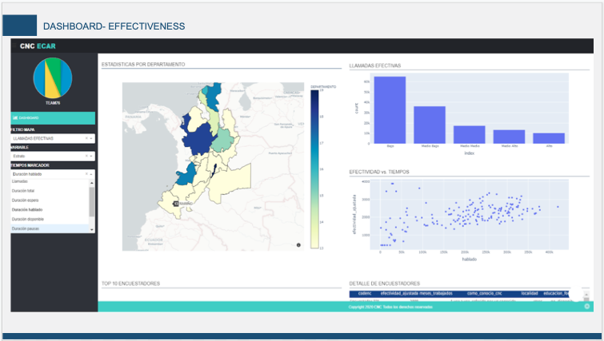

# DS4A-Team76

## Summary 🚀

This github repository contains the implementation of the app about  ECAR project, which TEAM-76 has been doing for the CNC, with the aim of discovering which variables are related to the productivity of the pollsters.

### FINAL DASH (FRONT-END)📋

The app can be viewed into  http://ec2-3-22-235-2.us-east-2.compute.amazonaws.com:8080

We use Dash, Ploty, mathplotlib, sklearn and the most popular libraries in python. 

### CONTENT 🖇️

This repository has 4 main folders. 

* App: The App development is carry out in different modules.
* Mintic - ECAR: This folder contains the raw data, of course it is privated, so it is a hidden folder. 
* Scripts: The scripts has some jupyter notebooks about data analysis previous the App development. 
* data_etls: This folder has the final and processed datasets to load into RDS in AWS, this is a hidden folder too.  

### APP

* about.py:About our team  
* app.py: html structure 
* index.py: the main code 
* info.py: Addittional info
* lib: The conexion, maps, graphics, tables, and everything about the dash. 
    * conexion.py 
    * consultas.py 
    * filtros.py
    * graficas.py
    * mapas.py 
    * paginas.py 
    * tablas.py 
    * textos.py 
* assets: Addittional frontend and styles structure

### SCRIPTS

* ETLS.ipynb : ETL process (raw data)
* datos_modelo.ipynb : ETL2, arrange a new dataset to do analysis exploratory and apply models
* EDA base efectivas.ipynb: Initial EDA 
* MODELO.ipynb: Implementing Random forest and cluster model

## FINAL REPORT 📖

You can find the final report in [DRIVE](https://docs.google.com/presentation/d/1y9SKTqcbH7ktBmrakduS5wZO_bNZrae9dW2qcS9ERr4/edit#slide=id.g89e564cf11_7_75)

## AUTHORS ✒️🤓

We are TEAM-76

* **Mildreck Cubillos** - * APP + DASH + DOCUMENTATION * - [Mildreck]()
* **Camilo Amezquita** - * APP + DASH + DOCUMENTATION * - [Camilo]()
* **Andrés Lopez** - * APP + DASH + DOCUMENTATION * - [Andres](https://github.com/AndresLopezDCo)
* **Angélica Castillo** - * APP + DASH + DOCUMENTATION * - [Angélica](https://github.com/MaAngelica)
* **Yesica Salas** - * APP + DASH + DOCUMENTATION*  - [Yesica](https://github.com/jekasa26)

## LICENSE 📄

This project is under the License (Your License) - see the file [LICENSE.md] (LICENSE.md) for details.

## Expresiones de Gratitud 🎁

* We are a fantastic group and we love working together for this project. 📢 🍺
* We really appreciate this data science course. It was amazing 🤓.Thanks mintic, thanks Correlation One. 
* CNC: That was really nice of you to allow us to do an exhaustive develop and analysis of CAR project

⌨️  ❤️ by TEAM-76 
